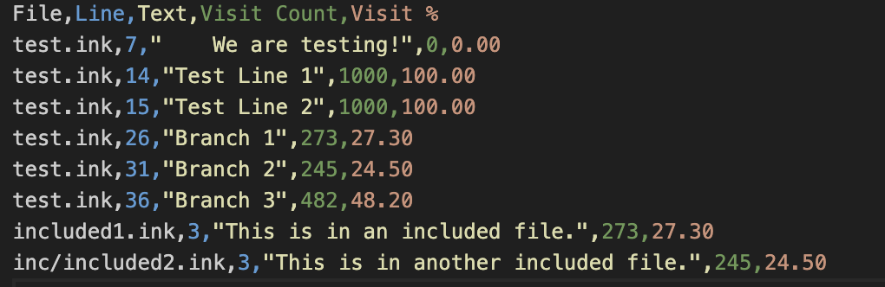

# Ink-Tester

**A simple tool to test an Ink story.**

## Contents
- [Overview](#overview)
- [Command-Line Tool](#command-line-tool)
- [Releases](#releases)
- [FAQ](#faq)
- [Caveats](#caveats)
- [Under the Hood](#under-the-hood)
- [Acknowledgements](#acknowledgements)
- [License and Attribution](#license-and-attribution)

## Overview

Runs your Ink story thousands of times, chooses random options, and creates a coverage report saying which lines it reached and how often.

If the visit count - or percentage - is zero then the line was never reached, and you should be asking yourself why. You almost certainly have logic errors.

If the visit count is low, then hardly any players are going to see that line. Is that what you want? Change your logic, re-run the tests, see if that helps!

### Out-Of-Content Check Mode
This tool can also be run in **out-of-content check** mode. Instead of recording visits, it specifically hunts for situations which cause an Ink "ran out of content" error, e.g.

`Ink Error: RUNTIME ERROR: 'outofcontent.ink' line 14: ran out of content. Do you need a '-> DONE' or '-> END'?`

If it finds any errors like this it will report them, and write them out into a CSV file, along with the last good content it found. **Note that in this mode it doesn't do a normal visit check.**

## Command-Line Tool
This is a command-line utility with a few arguments. A few simple examples:

Run the tool on the file Main.ink in the current directory, and output the report.csv file.\
`InkTesterTool.exe --storyFile=Main.ink --csv=report.csv`

Run the tool on the file Main.ink in the subfolder inkFiles, and output the report.csv file to the output folder.\
`InkTesterTool.exe --folder=inkFiles/ --storyFile=Main.ink --runs=10000 --csv=output/report.csv`

Set the Ink variable TEST_MODE to true, run the tool on the file Main.ink in the current directory, and output the report.csv file.\
`InkTesterTool.exe --storyFile=Main.ink --csv=output/report.csv --testVar=TEST_MODE`

Run an out-of-content check to report.csv instead.\
`InkTesterTool.exe --storyFile=Main.ink --csv=output/report.csv --ooc`

### Arguments

* `--folder=<folder>`
    Folder to act as root folder when testing the Ink. Used for locating include files.\
    e.g. `--folder=inkFiles/`\
    Default is the current working dir.

* `--storyFile=<file>`

    Ink file to test.\
    e.g. `--storyFile=start.ink`

* `--csv=<csvFile>`

    Path to a CSV file to export the data to, relative to working dir.\
    e.g. `--csv=output/strings.csv`\
    Default is empty, so no CSV file will be exported.

* `--testVar=<varName>`

    Set this variable in Ink to True. Useful for setting test data in Ink itself. Gives an error if your ink story doesn't define a variable of this name.\
    e.g. `--testVar=IsTestRunning` assuming that your Ink contains `VAR IsTestRunning=false` normally.

* `--maxSteps=<num>`

    How many steps to allow your ink story to take before ending. This avoids infinite loops and deals with stories that don't have an explicit `->END`.\
    e.g. `--maxSteps=1000`\
    Default is 10000, to avoid infinite loops - but when using default, an error will be reported and testing will cease. If you specify your own maxSteps, this won't error.

* `--maxChoices=<num>`

    If this is >=0, limits the number of choices tested at each choice point. This is useful to emulate a UI which only shows a limited set of choices at any one time. This assumes it's drawing from the top.\
    e.g. `--maxChoices=3` means 'only test the first 3 of every set of choices'\

* `--ooc`
    
    Run an out-of-content check, instead of the normal coverage check.

* `--help`

    This help!

## Releases
You can find releases for various platforms [here](https://github.com/wildwinter/Ink-Tester/releases
).

## FAQ
**What kind of lines are shown?**
    
All printable text lines should be shown. Note that means choices that only consist of hidden content won't be in the spreadsheet e.g. 
`* [Choose This Line]`
won't be on the spreadsheet, but
`* Choose This Line`
will be.

**How does it calculate the visit count?**

For each run, the tool simply records if a line has been visited or not. Then it aggregates that data over all the runs. If you visit a line multiple times in one run, that's still only counted as - yep, visited.

## Caveats
This isn't very complicated or sophisticated, so your mileage may vary!

## Under the Hood
Developed in .NET / C#.

The tool internally uses Inkle's **Ink Parser** to accurately find relevant lines of content, and **Ink Runtime** to run the story.

## Acknowledgements
Obviously, huge thanks to [Inkle](https://www.inklestudios.com/) (and **Joseph Humfrey** in particular) for [Ink](https://www.inklestudios.com/ink/) and the ecosystem around it, it's made my life way easier.

Thanks to **Dan Fabulich** of [Choice of Games](https://www.choiceofgames.com/) for the idea - he developed a similar tool for testing ChoiceScript and I've always found that concept useful.

## License and Attribution
This is licensed under the MIT license - you should find it in the root folder. If you're successfully or unsuccessfully using this tool, I'd love to hear about it!

You can find me [on Medium, here](https://wildwinter.medium.com/).